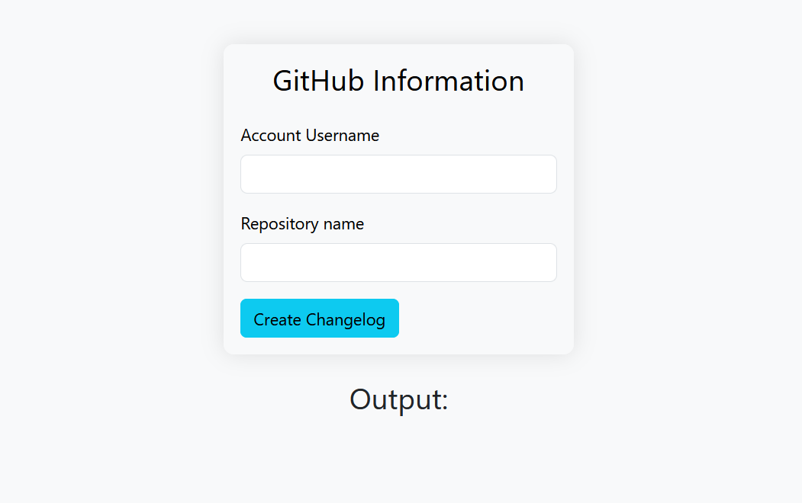
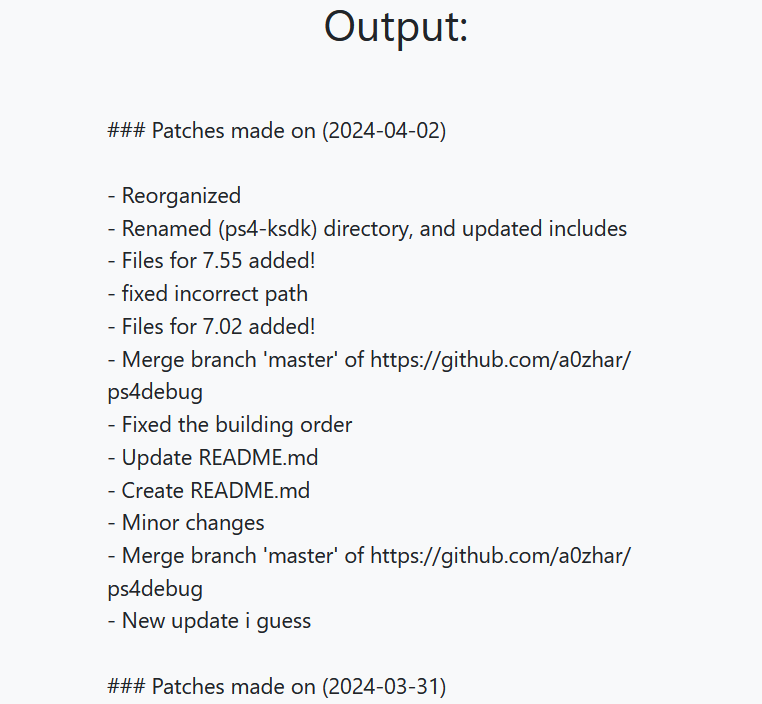

# Github Changelog Generator
Easy to use, Fully Web-based, Github Markdown style Changelog Generator. All it needs is the Account Username, and the Repository name, and it will generate changelog for that repository looking like:
```md
### Patches made on <YYYY-MM-DD>
- <Commit Title>
  - <Additional Data>
  - <Additional Data>
  - <Additional Data>
  - <Additional Data>
- <Commit Title>
- <Commit Title>
- <Commit Title>
```

It uses latest version of Bootstrap for the UI part, Javascript for the web-Request to get commits...

----
### Screenshots

**Initial Form**


**Generated Changelog**


<br>
----

### Credits
- Me (A0ZHAR)